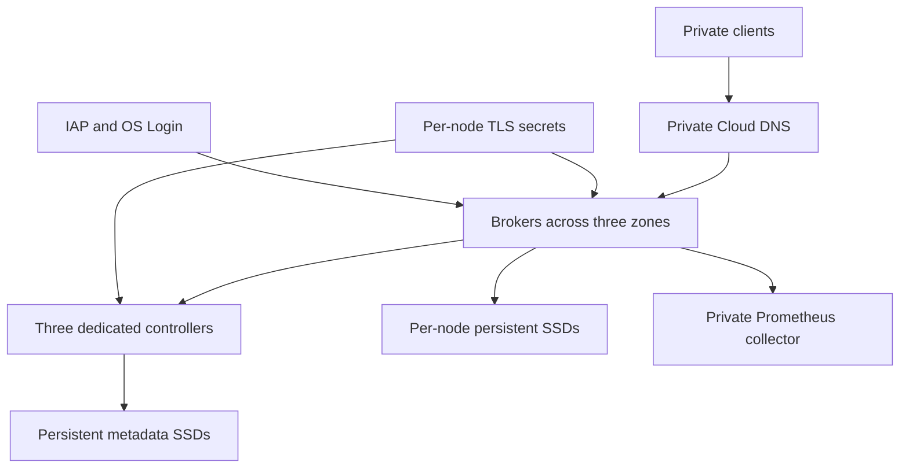

# Architecture

The default deployment has three dedicated KRaft controllers and three brokers across three zones in one GCP region. Controller IDs start at 100; broker IDs start at 1. Terraform retains one cluster UUID and initial controller directory UUIDs. These values are part of the identity of the cluster, not disposable configuration.

## Network paths

| Path | Port | Restriction |
| --- | --- | --- |
| Client to broker | TCP 9092 | Explicit private client CIDRs, TLS identity and ACL |
| Node to broker | TCP 9094 | Node service accounts, mutual TLS |
| Node to controller | TCP 9093 | Node service accounts, mutual TLS |
| Collector to node | TCP 9404 | Explicit private metrics CIDRs |
| Administrator to node | TCP 22 | IAP source range plus IAM and OS Login |

No VM has an external IP. Cloud NAT provides outbound access for Debian packages and pinned Kafka/exporter artifacts. Private Google Access supports Google API paths. DNS is visible to this VPC only; peered networks need DNS peering or forwarding in addition to routes and firewalls. Bootstrap addresses do not replace access to every advertised broker endpoint.

## Failure envelope

Three controllers tolerate one voting member loss. RF3/minISR2 with `acks=all` tolerates one unavailable replica of a partition. Zone awareness distributes replicas, but topic assignment and zone skew still need verification. Adding brokers does not move partitions automatically. The default three-broker layout cannot restore RF3 while a broker remains absent; a replacement is required. Region loss requires a separate recovery cluster.

