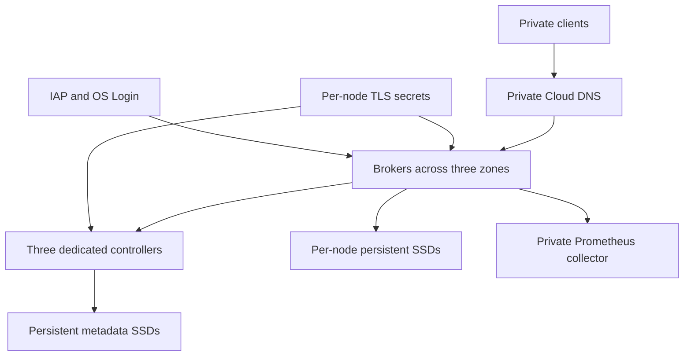

# Architecture

The default deployment has three dedicated KRaft controllers and three brokers across three zones in one GCP region. Controller IDs start at 100; broker IDs start at 1. Terraform retains one cluster UUID and initial controller directory UUIDs. These values are part of the identity of the cluster, not disposable configuration.

